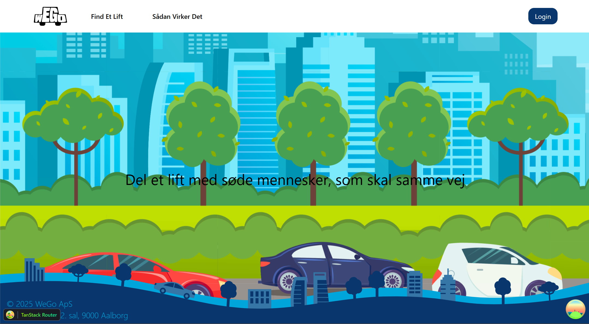
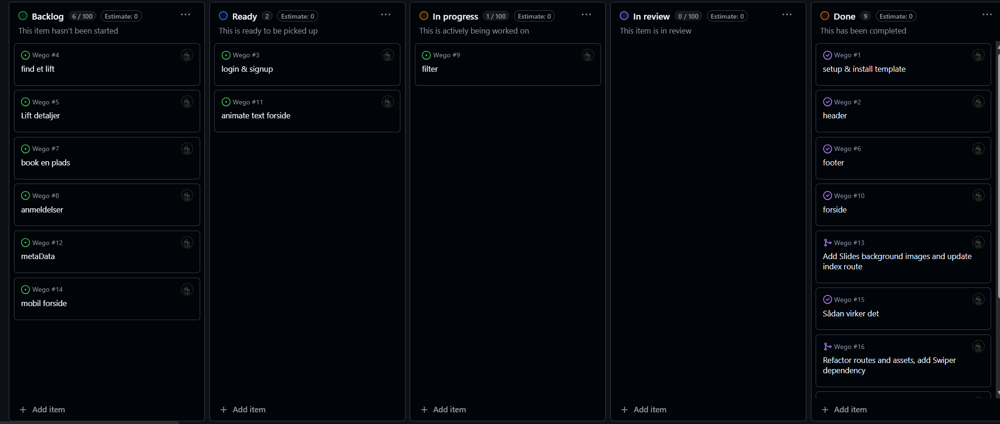
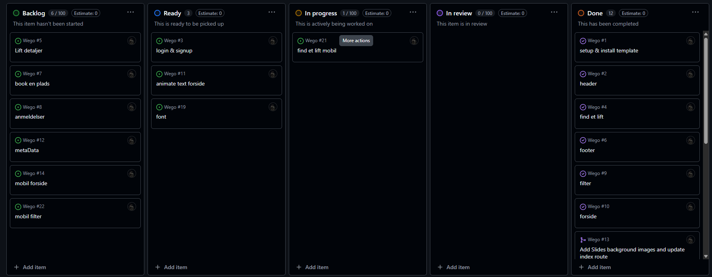
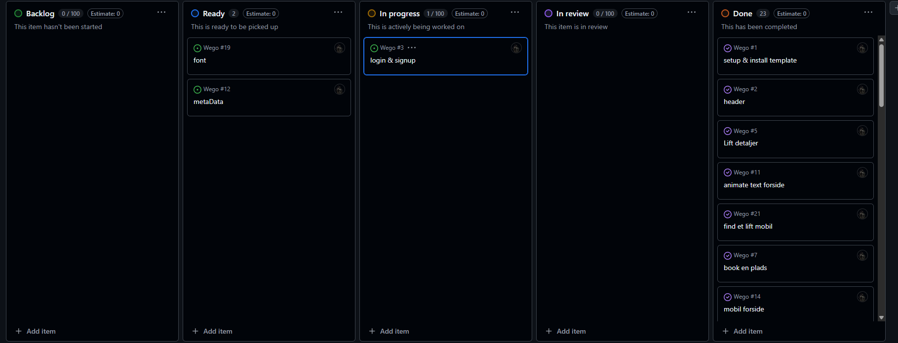

# Wego

## William leander jensen - H1WE080124

**Repo - <https://github.com/willy0483/Wego>**

**Brugernavn** - info@webudvikler.dk

**Adgangskode** - password

## Indholdsfortegnelse

1. Vurdering af egen indsats og gennemførelse

2. Argumentation for de valg du har truffet under løsningen af opgaven

3. Redegørelse af de forskellige kodeelementer i prøven

4. Fremhævelse af punkter til bedømmelse

5. Bilag

### Vurdering af egen indsats og gennemførelse

jeg startede med at læse opgaven igennem og lave issues og så satte jeg min template op med backend og derefter gik jeg i gang med min issues som header footer og forside har haft nogen småproblemer med style og images efter det lavede jeg find et lift med filter som tog mig noget tid at finde ud af med dato men jeg fandt en npm-pakke der kunne hjælpe efter lave jeg søg filter hvor jeg bruge et temp useState til at holde på text uden at søg har lavet så image kommer ud fra backend med reviewer derefter gik jeg til lift details og review med booking og så gik jeg til min side hvor der var mange problemer med logindata usequery men fandt en løsing og fik lavet pagination kun på senere og ikke dem som er i dag eller i morgen efter det lavet jeg signup og login og metadata

### Argumentation for de valg du har truffet under løsningen af opgaven

Jeg har ændret designet på login så den har sin egen side og det samme gælder signup.Mobilnav har dog ikke helt den samme stil men næsten

lavert så filter også er der til mobil

har lavet så man kan vælge flere bagage en eller flere

der er kun en type BRÆNDSTOFTYPE så bliver kun er den elektrisk eller ikke

har lavet lidt om på booking design så det passer lidt mere til mobil og desktop

### Redegørelse af de forskellige kodeelementer i prøven

Jeg har bruge shadcn og tailwind til nogen komponter <https://ui.shadcn.com/docs> kan ogsp see i ui mappe

jeg har bruge swiperjs til at lave silder
<https://swiperjs.com/>

jeg har brugt date-fns til dato
<https://www.npmjs.com/package/date-fns>

jeg har brugt react-simple-star-rating til starrating ved review
<https://www.npmjs.com/package/react-simple-star-rating>

text-animation som jeg har fra framer motion ui website
<https://ui.indie-starter.dev/docs/text-animation>

### Fremhævelse af punkter til bedømmelse

jeg vil gerne fortælle om hvorfor jeg har brugt tanstack og nogen af de ting den kan og med dens dev tools og cache

### Bilag

### Day1

### Day2

### Day 3

